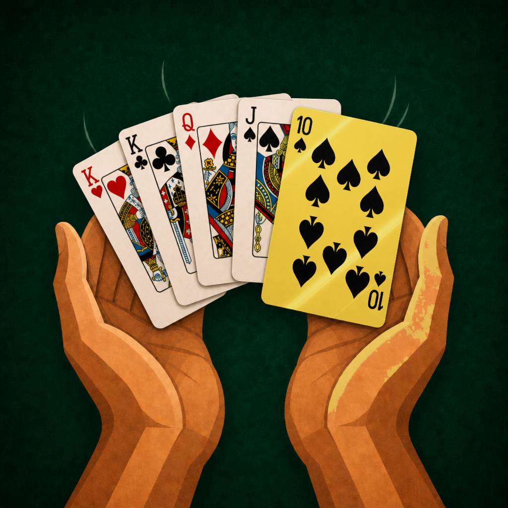

  

# Scoop

A [Board Game Arena](https://boardgamearena.com) adaptation of **Scoop**, a shedding card game for 2–6 players. Lowest penalty score after one round per player wins.

This repo is a BGA Studio project on the current (2025+) framework: PHP 8 state classes, a Deck component, and an ES6 client.

## How it plays

Each player starts a round with **19 cards**: 11 in hand, 4 face-up on the table, and 4 face-down under those. Hands sort with **10s first** (then K, Q, J, …, A). Play goes onto a shared middle pile.

- Play one or more cards of the **same rank**, equal to or lower than the pile’s top rank (empty pile: anything).
- **10s** beat anything and **scoop** the pile (it goes to discard). Completing **four of a kind** on the top rank also scoops. After a scoop, that player plays again.
- If you cannot or will not play, **pick up** the pile into your hand (and play again).
- Uncovered **face-down** cards can be played blind. An illegal reveal picks up the pile.
- First player to empty all zones **goes out**; everyone else gets one last turn, then remaining cards score as penalties.

**Penalties:** A = 1, 2–9 = face value, J/Q/K = 10, **10 = 20**. After *N* rounds (*N* = player count), lowest total wins.

Table option: **2 / 3 / 4 decks** (default 3). Tens are painted gold foil in the UI — that is the scoop rank, not a theme.

## Repo map

| Path | Role |
|---|---|
| [`modules/php/Game.php`](modules/php/Game.php) | Table logic, deals, play validation, scoop / pickup, scoring |
| [`modules/php/Cards.php`](modules/php/Cards.php) | Ranks, suits, strength, points, deck encoding |
| [`modules/php/States/`](modules/php/States/) | One class per game state |
| [`modules/js/Game.js`](modules/js/Game.js) | Client UI, selection, notifications |
| [`scoop.css`](scoop.css) | Table felt, card faces, gold-10 foil |
| [`img/`](img/) | Card faces, backs, felt — **everything in this folder root is preloaded** |
| [`gameinfos.jsonc`](gameinfos.jsonc) / [`gameoptions.jsonc`](gameoptions.jsonc) | Players, duration, deck-count option |
| [`dbmodel.sql`](dbmodel.sql) | `card` table for the Deck component |
| [`misc/STUDIO_SMOKE.md`](misc/STUDIO_SMOKE.md) | Studio test checklist after a deploy |

The live client is [`modules/js/Game.js`](modules/js/Game.js) + [`scoop.css`](scoop.css) (plain JS/CSS, no compile step).

## Studio

Deploy to BGA Studio and work through [`misc/STUDIO_SMOKE.md`](misc/STUDIO_SMOKE.md). Do not put unused art in `img/` (it is preloaded for every player). Cover / box / banner art for the public game page belongs in Studio’s Game Metadata Manager, not this folder; the illustration above is repo-only.

See [`AGENTS.md`](AGENTS.md) if you are an agent picking this project up.
